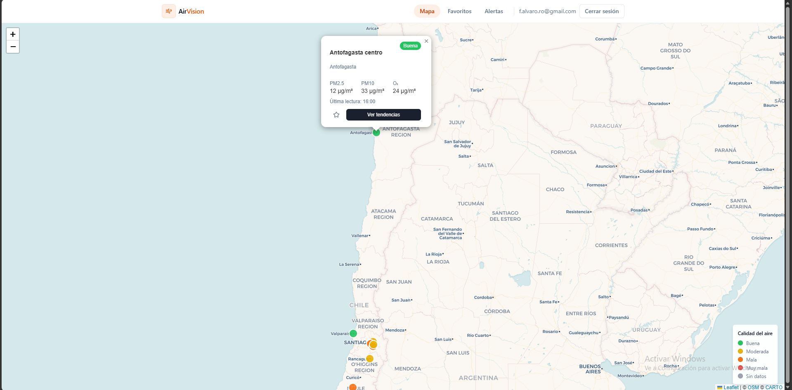
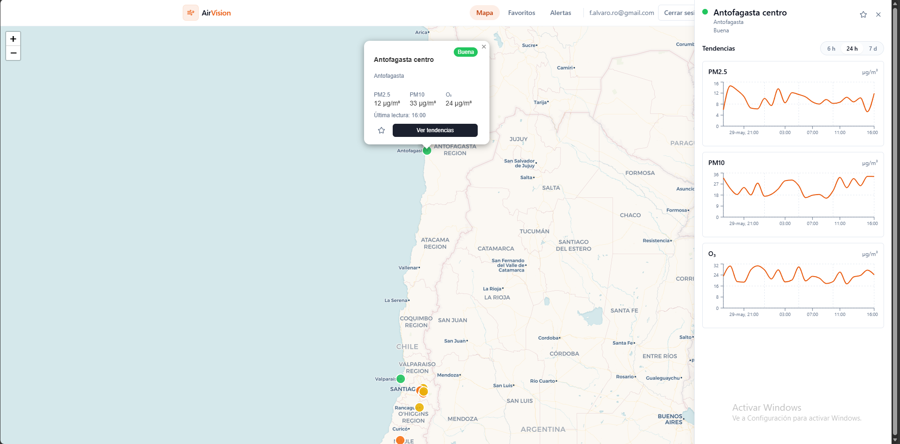
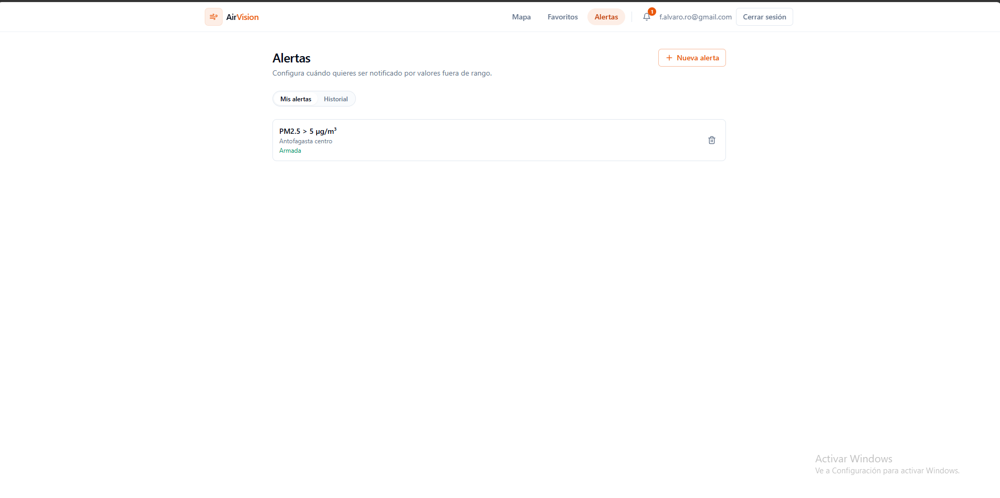

# AirVision 🌎

**Dashboard de calidad del aire de Chile en tiempo real: mapa interactivo, tendencias históricas y alertas personalizadas.**

[](https://air-vision-xi.vercel.app/)
[](https://www.typescriptlang.org/)
[](https://react.dev/)
[](https://supabase.com/)
[](https://vitest.dev/)
[](#tests)
[](#licencia)

---

## Descripción

**AirVision** es un dashboard web que muestra la calidad del aire de estaciones de monitoreo en Chile. Sobre un mapa de Chile, cada estación aparece coloreada según su lectura más reciente (clasificación _worst-of_ entre PM2.5, PM10 y O₃, contra los umbrales de la OMS). El usuario puede abrir una estación para ver sus tendencias temporales, marcar estaciones como favoritas y configurar alertas que se disparan cuando un contaminante cruza un umbral definido.

Es un **proyecto de portafolio** construido para demostrar prácticas profesionales de ingeniería fullstack: TypeScript en modo estricto, una capa de datos encapsulada en hooks, Row Level Security en cada tabla, suscripciones en tiempo real, y una suite de tests con cobertura sobre la lógica de negocio. No es un experimento de fin de semana: cada feature se diseñó con **Spec-Driven Development** (ver [sección dedicada](#spec-driven-development)) antes de escribir una línea de código.

El problema que resuelve es concreto: la información de calidad del aire suele estar dispersa en portales gubernamentales poco amigables. AirVision la centraliza en una interfaz en español, responsive y con actualización en vivo, donde un vecino de Santiago, Concepción o Temuco puede ver de un vistazo si el aire de su comuna está en niveles saludables.

## Demo

**🔗 [Ver la demo en vivo →](https://air-vision-xi.vercel.app/)** — desplegada en Vercel (frontend) + Supabase Cloud (backend).

<table>
  <tr>
    <td width="50%"></td>
    <td width="50%"></td>
  </tr>
  <tr>
    <td colspan="2"></td>
  </tr>
</table>

> Mapa interactivo · panel de tendencias en tiempo real · alertas personalizadas. Detalle de cada pantalla en [Features](#features).

## Features

Las cinco historias de usuario del MVP, más la búsqueda y el filtrado de estaciones (feature 004), están implementadas, probadas y en `main`.

### 🗺️ US1 — Mapa interactivo de calidad del aire

- Mapa de Chile con [Leaflet](https://leafletjs.com/) (`react-leaflet`) y tiles de OpenStreetMap.
- Cada estación es un marcador coloreado según su nivel _worst-of_: se toma el peor entre PM2.5, PM10 y O₃ clasificados contra los umbrales de la OMS.
- Popup por estación con los tres contaminantes, sus unidades, badge de nivel y timestamp relativo ("hace 2 h").
- Sin login: un visitante anónimo ve el mapa completo de inmediato.
- Manejo explícito de los tres estados (cargando, error con reintento, sin datos) con copy en español.

### 📈 US2 — Tendencias temporales por estación

- Panel deslizable (slide-over en desktop, bottom sheet en móvil) con tres gráficos de línea ([Recharts](https://recharts.org/)): PM2.5, PM10 y O₃.
- Selector de rango **6h / 24h / 7d** que re-consulta y redibuja.
- **Realtime por estación**: al insertarse una nueva lectura en la base, el gráfico añade el punto sin recargar la página, vía canales de Supabase Realtime filtrados por `station_id`.

### 🔐 US3 — Cuenta e inicio de sesión

- Registro y login con email + contraseña mediante **Supabase Auth**.
- Sesión persistente entre recargas (bootstrap con `getSession` + `onAuthStateChange`).
- Errores de autenticación mapeados a mensajes en español.
- Rutas protegidas (`/favoritos`, `/alertas`) mediante un componente `AuthGate`.

### ⭐ US4 — Estaciones favoritas

- Marcar/desmarcar estaciones como favoritas desde el popup del mapa o el panel de tendencias.
- **Tope de 10 favoritos por usuario**, garantizado con un trigger PL/pgSQL `BEFORE INSERT` (defensa server-side, no solo validación de cliente).
- Página `/favoritos` con grid responsive y la última lectura de cada estación marcada.

### 🔔 US5 — Alertas personalizadas

- Crear hasta 5 alertas (estación + contaminante + umbral + dirección "mayor/menor que").
- Alertas **edge-triggered**: cada alerta dispara **una sola vez** al cruzar el umbral y se **re-arma** cuando una medición posterior deja de cumplir la condición. Implementado como máquina de estado dentro de un trigger `AFTER INSERT` en `readings` (`evaluate_alerts()`).
- Historial de las **últimas 20** activaciones (rotación automática vía trigger).
- Badge de no leídas en el header + toasts en tiempo real cuando una alerta dispara con la sesión activa.

### 🧭 Búsqueda y filtrado de estaciones (feature 004)

- **Buscador** accesible (combobox con teclado) por nombre de estación o comuna; al elegir una, el mapa vuela hasta ella y abre su detalle.
- **Toggle para ocultar/mostrar estaciones sin datos recientes** (ocultas por defecto para un mapa limpio) con un **contador** "Mostrando X de Y estaciones".
- **Filtro por nivel de calidad** mediante chips (worst-of), combinable con la búsqueda y el toggle.
- **Clustering de marcadores** con [Supercluster](https://github.com/mapbox/supercluster): al alejar el zoom las estaciones cercanas se agrupan en una burbuja con su conteo; al pulsarla, el mapa encuadra todas sus estaciones.
- **"Estaciones cerca de mí"** por geolocalización del navegador, con mensaje de fallback en español si se deniega el permiso.
- 100% en el cliente sobre las estaciones ya cargadas: sin nuevas consultas por tecla ni cambios de base de datos. Diseño en [`specs/004-station-search-filters/`](specs/004-station-search-filters/).

## Stack técnico

| Capa              | Tecnología                                                                           |
| ----------------- | ------------------------------------------------------------------------------------ |
| **Frontend**      | React 18.3 · Vite 5.4 · TypeScript 5.6 (modo estricto) · React Router 6.27           |
| **UI / estilos**  | Tailwind CSS 3.4 · lucide-react (íconos) · sonner (toasts)                           |
| **Visualización** | Recharts 2.13 (gráficos) · Leaflet 1.9 / react-leaflet 4.2 (mapa)                    |
| **Estado**        | Zustand 5.0 (estado compartido) · React hooks (estado local)                         |
| **Backend**       | Supabase — PostgreSQL · Auth · Realtime · Edge Functions (Deno) · Row Level Security |
| **Testing**       | Vitest 2.1 · React Testing Library 16 · @vitest/coverage-v8                          |
| **Calidad**       | ESLint 9 (flat config) · Prettier 3 · Husky 9 + lint-staged · GitHub Actions CI      |
| **Deploy**        | Vercel (frontend) · Supabase Cloud (backend)                                         |

## Arquitectura

El principio rector es una **frontera arquitectónica estricta**: el frontend **nunca llama a APIs externas** directamente. La única fuente de datos del cliente es Supabase; la ingesta de datos externos (OpenAQ) vive exclusivamente en Edge Functions del lado del servidor.

```
   ┌──────────────────┐     supabase-js (anon key)      ┌─────────────────────────────┐
   │   React + Vite   │  ◄──────────────────────────►   │           Supabase          │
   │    (navegador)   │   REST + Realtime + Auth        │  Postgres · Auth · RLS      │
   └──────────────────┘                                 │  Realtime · Edge Functions  │
            ▲                                            └──────────────┬──────────────┘
            │  nunca llama APIs externas                                │ service_role
            │  (Constitución, Principio II)                             ▼  (solo server-side)
            │                                            ┌─────────────────────────────┐
            └─ toda query Supabase vive en src/hooks/    │   Edge Function (Deno)      │
               los componentes nunca importan el cliente │   ingest-openaq  */15 min   │ ──► OpenAQ v3
                                                         └─────────────────────────────┘
```

Decisiones clave que se reflejan en el código:

- **La capa de datos vive en `src/hooks/`.** Ningún componente importa el cliente Supabase: lo consume a través de hooks (`useStations`, `useStationReadings`, `useFavorites`, `useAlerts`…). Esto mantiene el árbol de render puro y testeable.
- **Row Level Security en todas las tablas.** Las tablas públicas (`stations`, `readings`) permiten solo `SELECT` anónimo; las tablas de usuario (`user_favorites`, `alerts`, `alert_history`) están restringidas por `auth.uid() = user_id`.
- **El `service_role` key nunca toca el bundle del cliente** — solo se usaría dentro de Edge Functions.
- **Lógica de negocio en la base de datos** donde corresponde: los topes (10 favoritos, 5 alertas), la evaluación edge-triggered de alertas y la rotación del historial son triggers PL/pgSQL, no validaciones de cliente fácilmente evadibles.

### Modelo de datos

| Objeto                    | Tipo  | Rol                                                                        |
| ------------------------- | ----- | -------------------------------------------------------------------------- |
| `stations`                | tabla | Estaciones de monitoreo (nombre, lat/lon, comuna). Lectura pública.        |
| `readings`                | tabla | Lecturas horarias (PM2.5/PM10/O₃, formato ancho). `UNIQUE(station, time)`. |
| `latest_station_readings` | vista | Última lectura por estación (`DISTINCT ON`, `security_invoker`).           |
| `user_favorites`          | tabla | Favoritos por usuario, PK compuesta, tope 10 vía trigger.                  |
| `alerts`                  | tabla | Alertas configuradas, con `is_armed` para el edge-trigger, tope 5.         |
| `alert_history`           | tabla | Activaciones de alertas, rotación a 20 vía trigger.                        |

`readings` y `alert_history` están publicadas en `supabase_realtime` para las suscripciones en vivo.

## Setup local

Requiere **Node 22+** (ver `.nvmrc`), **npm 10+** y la **Supabase CLI**. Guía detallada (y troubleshooting) en [`SETUP.md`](./SETUP.md).

```bash
# 1. Clonar e instalar dependencias (respeta el lockfile)
git clone https://github.com/Homzk/AirVision.git
cd AirVision
npm ci

# 2. Configurar variables de entorno
cp .env.example .env.local
# Editar .env.local con VITE_SUPABASE_URL y VITE_SUPABASE_ANON_KEY (anon key legacy, JWT "eyJ…")
```

```bash
# 3. Vincular el proyecto a Supabase Cloud
supabase login
supabase link --project-ref <tu-project-ref>

# 4. Aplicar las migraciones a la base remota
supabase db push
```

```sql
-- 5. Sembrar datos de prueba (Supabase Studio → SQL Editor)
--    Pegar el contenido de supabase/seed.sql y ejecutar.
--    Crea 12 estaciones de Chile + 24 h de lecturas horarias. Idempotente.
```

```bash
# 6. Arrancar la app
npm run dev          # Vite en http://localhost:5173
```

> Solo dos variables de entorno son obligatorias para correr el **frontend**: `VITE_SUPABASE_URL` y `VITE_SUPABASE_ANON_KEY`. La `OPENAQ_API_KEY` y el `SUPABASE_SERVICE_ROLE_KEY` son **server-side** (solo para las Edge Functions de ingesta, ver [feature 002](specs/002-openaq-ingestion/)); nunca llegan al cliente.

## Tests

La disciplina de testing es un principio de la constitución del proyecto: tests **co-localizados** con el archivo que prueban, escritos en el mismo cambio que el código.

```bash
npm run test           # Vitest en modo watch
npm run test:run       # corre una vez y sale
npm run test:coverage  # corre con reporte de cobertura
npm run test:e2e       # suite end-to-end con Playwright (build + preview + Chromium)
npm run test:e2e:ui    # Playwright en modo UI interactivo (debug)
```

**Tests end-to-end (Playwright, feature 003):** una suite en `e2e/` ejercita la app real en un navegador contra el Supabase desplegado, cubriendo los cuatro flujos (mapa público, registro/login, favoritos, alertas). Los flujos autenticados usan cuentas efímeras creadas vía la API admin y limpiadas al terminar; el disparo de alertas se provoca inyectando una lectura con `service_role` **fuera del navegador**. Requiere `SUPABASE_SERVICE_ROLE_KEY` en `.env.local` (solo para el runner). Corre también en CI (job `e2e`) como gate de cada push/PR. Diseño en [`specs/003-e2e-playwright-tests/`](specs/003-e2e-playwright-tests/).

**Métricas actuales:**

- ✅ **166 tests** pasando
- 📊 **97.25% de cobertura de líneas** · **90.36% de ramas**
- 🎯 Umbral mínimo (_gate_) configurado: **70% líneas / 65% ramas** sobre `src/hooks/`, `src/utils/`, `src/stores/` y `src/lib/`

Los tests cubren la lógica pura (clasificación de niveles contra umbrales OMS, formateo de fechas), los stores de Zustand (transiciones de estado), los hooks con Supabase mockeado (`vi.mock()`, sin red real) y los componentes de formulario y visualización. Los tests E2E con Playwright (diferidos del MVP por la constitución) se añadieron como feature post-MVP (003) y cubren los flujos completos en navegador (ver arriba).

## Spec-Driven Development

AirVision se construyó con **[Spec Kit](https://github.com/github/spec-kit)**, un flujo de _Spec-Driven Development_ donde la especificación, el plan técnico y la lista de tareas se redactan **antes** de implementar. Todo el diseño del feature vive versionado en el repo:

```
specs/001-air-quality-dashboard/
├── spec.md            # Qué se construye y por qué (historias de usuario, criterios)
├── plan.md            # Stack, estructura, decisiones técnicas
├── research.md        # Investigación previa (OpenAQ, umbrales OMS, etc.)
├── data-model.md      # Esquema de tablas, RLS, triggers
├── contracts/         # Contratos de RPC, Edge Functions y canales Realtime
├── quickstart.md      # Guía de validación manual
└── tasks.md           # 116 tareas trazables (T001…T116), una por commit-scope
```

El proyecto se rige además por una **constitución** ([`.specify/memory/constitution.md`](./.specify/memory/constitution.md)) con principios no negociables: type safety, fronteras arquitectónicas, seguridad por defecto (RLS), calidad de UX, workflow convencional y disciplina de testing. Cada decisión de diseño es trazable hasta su task y su principio. Este enfoque es lo que diferencia a AirVision de un proyecto de portafolio improvisado.

## Roadmap

**Phase 8 (Polish) — ✅ completada:** verificación responsive a 360px, `ReconnectingIndicator` de estado Realtime en el header, **deploy a Vercel en vivo** con variables de entorno configuradas, README + screenshots, y los siete Quality Gates de la constitución en verde.

**Feature 002 — Ingesta real desde OpenAQ v3 — ✅ completada:** la app corre con **datos reales** de la red chilena (SINCA vía OpenAQ v3), no con seed sintético. Dos Edge Functions (Deno) del lado del servidor: `seed-stations` pobló el catálogo con **~169 estaciones reales** de Chile, e `ingest-openaq` ingiere mediciones (PM2.5/PM10/O₃) con upsert idempotente `COALESCE`, descarte de lecturas rancias (regla _R-fresh_, ≤3 h por contaminante) e inválidas. Corre **automáticamente cada 15 min** con un cron `pg_cron` + `pg_net` (`*/15 * * * *`); el frontend nunca toca OpenAQ (Constitución, Principio II). Diseño completo en [`specs/002-openaq-ingestion/`](specs/002-openaq-ingestion/).

**Feature 003 — Suite de tests E2E con Playwright — ✅ completada:** una suite end-to-end en `e2e/` ejercita la app real en Chromium contra el Supabase desplegado, cubriendo los cuatro flujos (mapa público, registro/login, favoritos, alertas). Los flujos autenticados usan cuentas efímeras creadas vía la API admin (limpiadas al terminar) y el disparo de alertas se provoca inyectando una lectura con `service_role` **fuera del navegador**. Corre en CI (job `e2e`) como **gate requerido** de cada push/PR sobre `main`, junto al job `quality` (lint, typecheck, tests). Diseño completo en [`specs/003-e2e-playwright-tests/`](specs/003-e2e-playwright-tests/).

**Feature 004 — Búsqueda y filtrado de estaciones en el mapa — ✅ completada:** mejora del descubrimiento en el mapa, 100% en el cliente sobre las estaciones ya cargadas (sin cambios de base de datos). Incluye un buscador accesible por nombre/comuna que centra el mapa en la estación elegida, un toggle para ocultar/mostrar las estaciones sin datos recientes con un contador "X de Y", chips de filtro por nivel de calidad (worst-of), clustering de marcadores con [Supercluster](https://github.com/mapbox/supercluster) para legibilidad al alejar el zoom, y "estaciones cerca de mí" por geolocalización del navegador. La lógica de filtrado/búsqueda/cercanía es pura y cubierta con tests; añade un spec E2E de descubrimiento. Diseño completo en [`specs/004-station-search-filters/`](specs/004-station-search-filters/).

Con las features 001–004 cerradas, el descubrimiento, la visualización, la ingesta y las pruebas del producto están implementados, probados y en `main`.

## Licencia

Distribuido bajo la licencia **MIT**. Ver [`LICENSE`](./LICENSE) para más detalles.

## Autor

Desarrollado por [**Homzk**](https://github.com/Homzk) como proyecto de portafolio fullstack.
